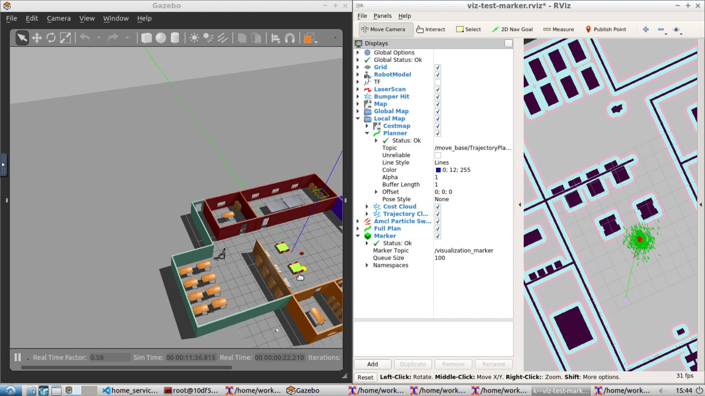
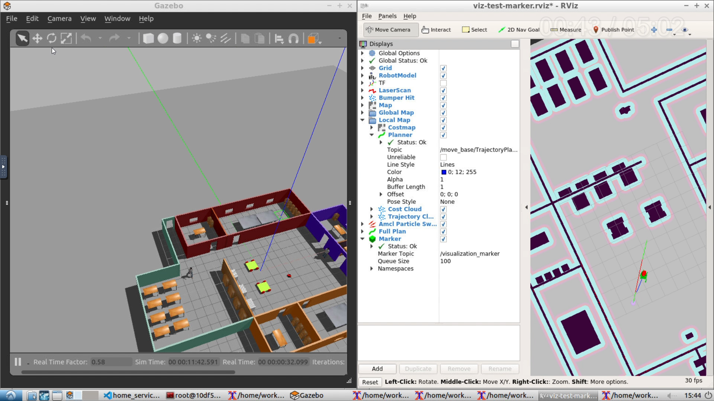
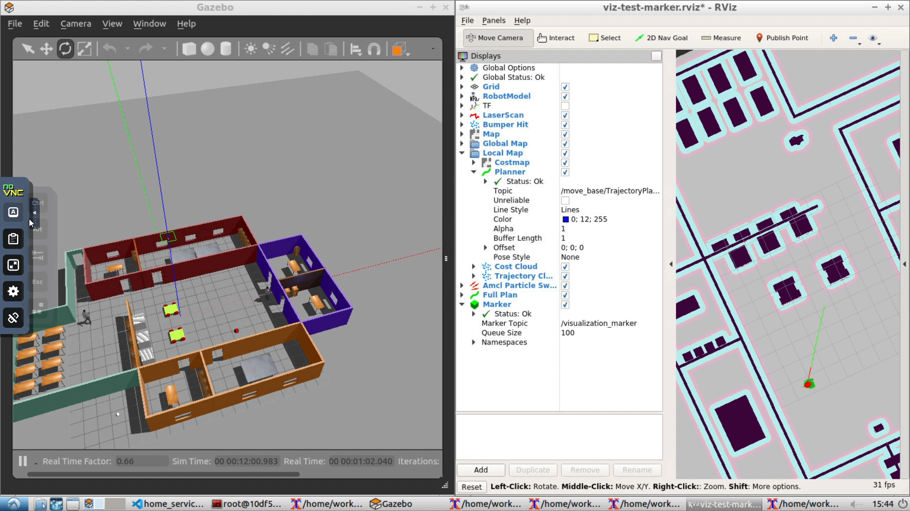
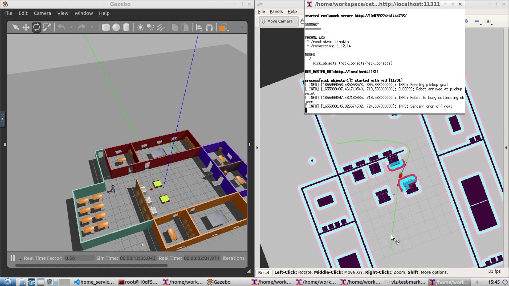
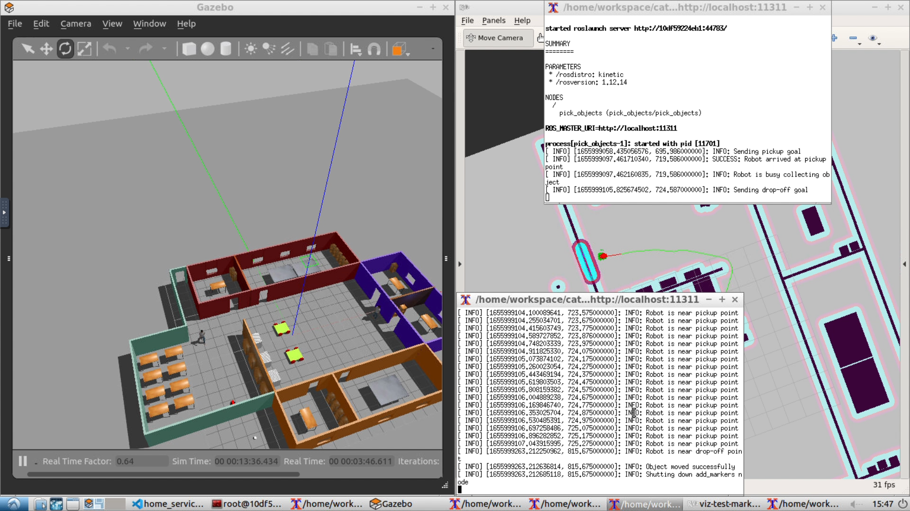
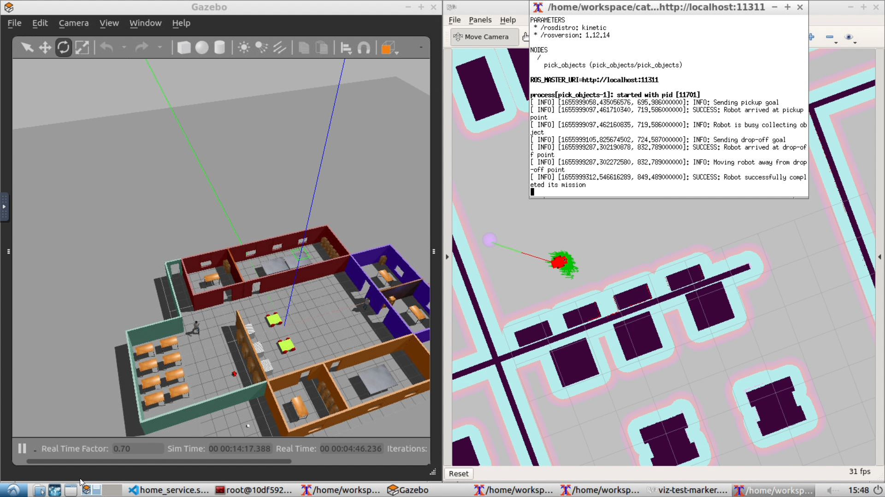

# Service-Robot
A service robot that can be tasked to pick up and drop off items in an indoor environment.

### Demo Run
A full demo run for this porject can be found at this link: https://youtu.be/DriO79eBzKM

## Overview

In this project a robot has been used to simulate a serviec robot which can perform service tasks in an indoor environment. This project can ben considered as a basis for building more advanced systems such as a roomba (robot vaccum cleaner). The models of the robot and the world have been made in gazebo.

**Keywords:** slam, localization, mapping, path planning, ros_nav_stack, base_planner, amcl.

**Author: Rutvik Patel **

The my_robot, add_markers and pick_objects packages have been tested under [ROS] Kinetic on Ubuntu 16.04.7 LTS (Xenial Xerus).
This is prototype code, expect that it won't be maintained for future ROS versions.

## Installation, Building and Running

### ROS Version

The project has been developed and tested on Ubuntu 16.04 LTS with [ROS Kinetic](wiki.ros.org/kinetic/).

Start by updating your system using <code>sudo apt-get update && sudo apt-get upgrade</code>

### Dependencies

- Install [map_server](http://wiki.ros.org/map_server) package using the command <code>sudo apt install ros-kinetic-map-server</code>
- Install [slam_gmapping](http://wiki.ros.org/slam_gmapping) package using the command <code>sudo apt install ros-kinetic-slam-gmapping</code>
- Install [amcl](http://wiki.ros.org/move_base) package using the command <code>sudo apt install ros-kinetic-amcl</code>
- Install [move_base](http://wiki.ros.org/move_base) package using the command <code>sudo apt install ros-kinetic-move_base</code>
- Install [teleop_twist_keyboard](http://wiki.ros.org/teleop_twist_keyboard) package using the command <code>sudo apt-get install ros-kinetic-teleop-twist-keyboard</code>

- Additionally install [xterm](https://invisible-island.net/xterm/) using the command <code>sudo apt-get install xterm</code>

### Building
At the catkin_was root, use <code>catkin_make</code> to build the packages from source.

### Launching the Project
To Launch the file go to the <code>scripts</code> directory and run the shell script of choice. The scripts will launch all the required ros nodes in different xterm terminal. The scripts perform the following tasks:
- <code>test_slam.sh</code>: Launch the gazebo world containing the robot along with <code>slam_gmapping</code> node to perform slam and generate map, <code>rviz</code> to vizualize the results and <code>teleop_twist_keyboard</code> to allow manual control of the robot.
- <code>test_navigation.sh</code>: Launch the gazebo world containing the robot along with <code>amcl</code> node to perform localization and <code>rviz</code> to vizualize the results.
- <code>pick_objects.sh</code>: Launch the gazebo world containing the robot along with <code>amcl</code> node to perform localization, <code>rviz</code> to vizualize the results and <code>pick_objects</code> node to test and simulate the robot motion from spawn location to pickup point and finally to drop-off point.
- <code>add_markers.sh</code>: Launch the gazebo world containing the robot along with <code>rviz</code> to vizualize the results and <code>add_markers</code> node to test and simulate the spawning of a visual object marker (purple colour) at the pickup and drop-off points.
- <code>home_service.sh</code>: This script launches the full project to simulate the working of the home robot and orchastrate the pickup and delivery mission. It launches the gazebo world containing the robot along with <code>amcl</code> node to perform localization, <code>rviz</code> to vizualize the results, and <code>pick_objects</code> and <code>add_marker</code> nodes the orchastrate the robot mission (path-planning and dummy object marker vizualization).

Run the scripts by invoking them as shell commands - <code>./<script_name>.sh</code>. If the script is not an executable, run the command <code>chmod +x <script_name>.sh</code> to make it an executable and then run the previous command. Alternatively, you can run the scripts using <code>bash <script_name>.sh</code> or <code>sh <script_name>.sh</code>

### Result
For a full demo run of the mission, refer to the video link above.
1. Robot at spawn location as soon as the gazebo world loads:  

2. Robot is on its way to pick up the purple ball (object in question):

3. Robot has reached the pickup point and has collected the object:

4. Robot is en route to the drop-off point:

5. Robot has reached the drop-off point and has delivered the object:

6. Robot has moved away and has successfully completed its mission:

#### References
- [ROS](wiki.ros.org/kinetic/)
- [rviz](http://wiki.ros.org/rviz)
- [Navigation Guide](https://www.google.com/url?sa=t&rct=j&q=&esrc=s&source=web&cd=&cad=rja&uact=8&ved=2ahUKEwjvqYny_MP4AhVHEqYKHS0TB7sQFnoECAQQAQ&url=https%3A%2F%2Fkaiyuzheng.me%2Fdocuments%2Fnavguide.pdf&usg=AOvVaw3hrnSbymHa2oHOYNTVlUXN) - Tune <code>base_planner</code> and <code>amcl</code> parameters.
